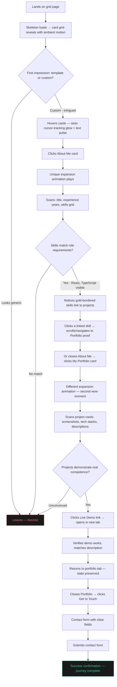
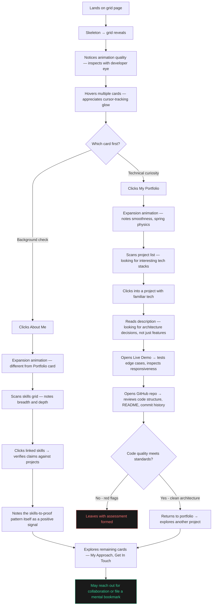
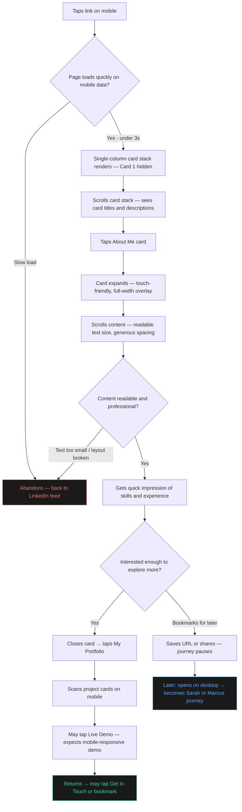

# UX Design Specification WS-Portfolio-New

**Author:** Warrick
**Date:** 2026-03-30

---

<!-- UX design content will be appended sequentially through collaborative workflow steps -->

## Executive Summary

### Project Vision

Modernize and polish a personal developer portfolio while preserving its distinctive card-based, click-to-animate interaction pattern. The site must demonstrate frontend competence through its own implementation — the UX itself is the first portfolio piece visitors experience. Every design decision serves dual purpose: presenting content effectively and showcasing technical skill.

### Target Users

**Primary: Recruiters & Hiring Managers** — Time-poor professionals scanning 20+ profiles. Need to assess competence in under 90 seconds. Scannable layouts, clear visual hierarchy, and immediate "this is custom-built" impression are critical. Desktop-dominant but may share links on mobile.

**Secondary: Fellow Developers & Collaborators** — Technically literate visitors who appreciate implementation quality. Notice animation smoothness, interaction patterns, and code craft. Will click through to live demos and GitHub repos. Mixed desktop/mobile.

**Tertiary: Mobile Visitors** — Any visitor accessing via phone (commute, Slack link tap, LinkedIn browse). Need full content access with no layout breakage, readable typography, and touch-friendly interactions. Single-column card stack, fast load on mobile data.

### Key Design Challenges

**1. Content Density vs. Scannability** — The About Me section currently crams personal info, experience, education, skills, and adaptability into a cell-based grid. Redesign must present more information (skills-to-proof mapping) while being *easier* to scan, not harder. The recruiter has 90 seconds.

**2. Portfolio Detail Without Overwhelm** — Current hover-to-reveal tooltips are too brief. The redesign needs richer project descriptions (purpose, tech stack, key features, live demo, repo link) without turning each project into a wall of text. The challenge is progressive disclosure within the card expansion paradigm.

**3. Animation Coherence Across Unique Transitions** — Per-card unique expansion animations (slide, morph, unfold) risk feeling inconsistent if not carefully choreographed. Each must feel distinct yet belong to the same design language. The dark theme and Framer Motion constraints unify them, but visual harmony requires deliberate design.

**4. Skeleton-to-Content Continuity** — Skeleton loading must mirror the exact card grid shape so the transition feels seamless. Any mismatch in proportions or timing creates a jarring flash rather than a polished reveal.

**5. Ambient Motion Without Distraction** — Background motion (gradient shift, particles) must add atmosphere without competing for attention, triggering motion sensitivity, or impacting performance. Subtle is the operating word — too much undermines the professional tone.

### Design Opportunities

**1. The Grid as a First Impression** — The landing page card grid is the first thing visitors see. With skeleton loading, ambient motion, and refined hover effects, this 2-3 second window becomes a "this isn't a template" moment that sets the portfolio apart before any content is read.

**2. Skills-to-Proof as a Trust Mechanism** — Linking skills directly to the projects that demonstrate them transforms a passive list into an interactive credibility system. Recruiters can verify claims with one click. This is uncommon in developer portfolios and immediately builds trust.

**3. Per-Card Animation as Personality** — Unique expansion animations for each card create a sense of discovery — visitors are rewarded for exploring. This turns passive content browsing into an experience with micro-moments of delight.

**4. Dark Theme as Design Canvas** — The dark theme provides natural contrast for neon glow effects, gold accents, and ambient motion. It's not just an aesthetic choice — it's an environment where subtle visual effects have maximum impact with minimal effort.

## Core User Experience

### Defining Experience

The core user action is **explore and assess** — a single-session, 1-3 minute experience where visitors land, interact with the card grid, and form a professional judgment. There is no recurring loop, no sign-up, no transaction. The entire product value is delivered in one visit.

The exploration is free-form — visitors click whatever catches their eye. No enforced sequence, but natural visual hierarchy guides discovery: About Me and My Portfolio are the primary draws, Get In Touch is lowest priority and positioned as the natural endpoint after assessment is complete. The card grid design itself communicates "explore me" through hover effects and visual invitation.

Single-session design: no return visit patterns, no state persistence, no "what's new" signals. Every visit is treated as the first and likely only visit.

### Platform Strategy

- **Primary:** Desktop web (recruiters at workstations, developers at desks)
- **Secondary:** Mobile web (link taps from LinkedIn, Slack, email)
- **Input:** Mouse/keyboard (desktop), touch (mobile)
- **Offline:** Not required
- **Device capabilities:** None beyond standard browser APIs
- **Responsive breakpoints:** 768px (mobile), 1000px (tablet) — existing pattern preserved
- **Card 1 (background image):** Hidden on mobile to preserve vertical space

### Effortless Interactions

**Card discovery must require zero instruction.** Visitors should immediately understand the grid is interactive without any onboarding text, tooltips, or tutorials. Hover effects and visual cues communicate clickability naturally.

**Card expansion must feel instant and fluid.** The click-to-expand transition is the signature interaction — any hesitation, stutter, or visual glitch breaks the spell. 60fps animations, no layout shift, immediate response to input.

**Content scanning must work at a glance.** Within an expanded card, visitors should grasp the key information (experience years, skills, project details) without reading every word. Visual hierarchy does the heavy lifting — headings, spacing, colour contrast guide the eye.

**Closing and returning to grid must be frictionless.** One click (close button) or Escape key returns to the grid instantly. No confusion about how to get back. Grid state is preserved — no scroll reset, no re-render.

**Portfolio project links must open cleanly.** Live demos and GitHub repos open in new tabs without breaking the portfolio experience. Visitor returns to the same expanded card when they switch back.

### Critical Success Moments

**Moment 1: The Grid Landing (0-2 seconds)** — Skeleton loading transitions smoothly into the card grid with ambient background motion. The visitor's first reaction must be "this isn't a template." This is the make-or-break moment — if the landing page looks generic, the recruiter moves on. *Every animation must have "wow" factor.*

**Moment 2: First Card Click (2-5 seconds)** — The visitor clicks their first card and sees a unique, polished expansion animation. This is when the distinctive interaction pattern reveals itself. The animation quality must feel deliberate and crafted — not a default library transition. *This is the "aha" moment that separates this portfolio from every other.*

**Moment 3: Content Assessment (5-30 seconds)** — Inside the expanded card, content is scannable and professional. About Me shows skills linked to proof. Portfolio shows rich project details with working links. The quality of content presentation confirms the first impression.

**Moment 4: Live Demo Verification (30-90 seconds)** — Visitor clicks through to a live project demo. It works. The portfolio description matches reality. Credibility is established through evidence, not claims.

**Moment 5: Contact Decision (60-180 seconds)** — If all moments land, the visitor opens Get In Touch. The contact form is the conversion event — everything before it is building toward this moment.

### Experience Principles

1. **Every animation earns its place** — No animation exists for decoration. Each one communicates state, creates delight, or reinforces the portfolio's identity. All must have "wow" factor — smooth, crafted, and intentional.

2. **Content serves the 90-second scan** — Recruiters don't read, they scan. Every content section is designed for visual hierarchy first, reading second. Key information is visible without scrolling when possible.

3. **The site is the first portfolio piece** — Implementation quality is on display from the first frame. Performance, animation smoothness, responsive behaviour, and attention to detail all demonstrate the skills the content describes.

4. **Progressive disclosure, not information dump** — The card grid → expansion → detail → live demo flow naturally layers information depth. Visitors control how deep they go. Nothing is overwhelming at any level.

5. **Free exploration, gentle guidance** — No enforced paths, but visual weight and positioning create a natural flow: grid → About Me / Portfolio → Contact. The experience rewards curiosity without punishing any click order.

## Desired Emotional Response

### Primary Emotional Goals

**Impressed** — Visitors should feel genuine surprise at the quality and craft of the site. Not "nice portfolio" but "this person clearly cares about their work." The animations, layout, and attention to detail create an impression that goes beyond content — the implementation itself is evidence of capability.

**Aware of detail and process orientation** — Every element should communicate deliberate, considered decision-making. Nothing feels accidental or default. The unique per-card animations, the skills-to-proof mapping, the dark theme polish — all signal someone who thinks through the details and follows a process.

### Emotional Journey Mapping

| Stage | Timing | Desired Feeling |
|-------|--------|----------------|
| Grid landing | 0-2s | Intrigued — "this is different from the usual portfolio sites" |
| Skeleton → content | 0-1.5s | Polished — "even the loading feels intentional" |
| Hover exploration | 2-5s | Curiosity — "I want to click these" |
| First card expansion | 3-6s | Impressed — "wow, that animation was crafted" |
| Content scanning | 5-30s | Confidence — "this person knows what they're doing" |
| Skills-to-proof click | 10-40s | Trust — "these claims are backed by real work" |
| Live demo visit | 30-90s | Respect — "this person ships working software" |
| Contact decision | 60-180s | Motivated — "I should reach out" |

### Micro-Emotions

**Critical to achieve:**
- **Confidence over confusion** — Navigation is self-evident, no guessing what to click or how to get back
- **Trust over scepticism** — Skills linked to proof, live demos that work, descriptions that match reality
- **Delight over mere satisfaction** — Animations create moments of genuine pleasure, not just functional transitions
- **Respect over indifference** — The cumulative effect of detail-orientation builds professional respect

**Critical to avoid:**
- **Never overwhelmed** — Content is layered through progressive disclosure, not dumped
- **Never impatient** — Animations are fast enough to feel responsive, long enough to feel crafted (300-600ms sweet spot)
- **Never lost** — Close button always visible, Escape always works, grid state always preserved
- **Never underwhelmed** — Every interaction must deliver on the promise of the landing page impression

### Design Implications

| Emotional Goal | UX Design Approach |
|---------------|-------------------|
| Impressed | Per-card unique animations, skeleton loading continuity, ambient motion — every visual element exceeds the "default" bar |
| Detail-oriented | Consistent spacing, aligned elements, pixel-perfect transitions, no orphaned text, no layout shift — the absence of flaws communicates as strongly as the presence of features |
| Intrigued | Hover effects that invite without instructing, subtle motion that rewards attention, gold accent colour creating visual anchors |
| Trust | Skills link to projects, projects link to live demos, descriptions match reality — verifiable credibility chain |
| Respect | Clean code reflected in clean performance — fast loads, smooth animations, no jank, no errors in console |

### Emotional Design Principles

1. **Craft over flash** — Animations should feel precisely engineered, not gratuitously showy. The difference between "impressive" and "gimmicky" is restraint and timing. Every effect should look like it took thought, not just code.

2. **Details signal process** — Consistent margins, aligned baselines, matching animation easing curves, coordinated colour usage — these small consistencies accumulate into an impression of methodical, process-driven work. Visitors may not consciously notice, but they feel it.

3. **Silence communicates too** — What the site *doesn't* do matters as much as what it does. No autoplay, no pop-ups, no scroll-jacking, no cookie banners, no unnecessary loading spinners. Restraint signals confidence.

4. **Verify, don't claim** — The emotional design avoids asking visitors to take claims at face value. Instead, every claim has a verification path: skill → project → live demo. Trust is earned through evidence, not assertion.

## UX Pattern Analysis & Inspiration

### Inspiring Products Analysis

**Premium Luxury Dark Aesthetic Reference Points:**

The premium/luxury dark aesthetic is characterised by restraint, high contrast, and deliberate use of accent colour. Products in this space share common traits:

- **Apple Pro product pages** (MacBook Pro, Pro Display) — Dark backgrounds with precise typography, generous whitespace, and content that reveals through scroll. Animations are smooth but never gratuitous. Every transition serves comprehension.
- **Stripe's developer documentation** — Dark mode that feels sophisticated, not just inverted. Colour is used sparingly and meaningfully. Code blocks and content cards have subtle depth through borders and shadows rather than heavy drop shadows.
- **Linear (project management)** — Dark UI with subtle gradients, crisp typography, and micro-animations that feel engineered. Hover states are refined — not just colour changes but subtle scale, glow, or opacity shifts.
- **Vercel's dashboard and marketing** — Dark theme with clean grid layouts, smooth page transitions, and a sense of technical precision. Cards and panels use subtle backdrop blur and border effects for depth.

**Common patterns across premium dark UX:**
- Backgrounds are not pure black (#000) — they use very dark greys (#0a0a0a to #141414) for depth layering
- Accent colours are used sparingly — one primary accent, applied consistently
- Typography has generous line height and letter spacing — text breathes
- Animations use easing curves that feel physical (spring, ease-out-cubic) not linear
- Hover states are subtle but present — opacity shifts, gentle scales, soft glows
- Borders and dividers are near-invisible (1px, low opacity white) — structure without clutter

### Transferable UX Patterns

**Navigation: Card Grid as Primary Navigation**
- The existing card grid pattern aligns with premium dark aesthetics well — cards with subtle borders and depth layering on a dark canvas create a sophisticated gallery feel
- Hover states should shift from the current neon glow toward more refined effects — subtle scale (1.02x), soft border glow, or gentle lift shadow

**Interaction: Progressive Reveal Through Motion**
- Premium sites reveal content through carefully timed motion rather than instant display
- Card expansion animations should use spring physics (Framer Motion spring config) for a physical, premium feel rather than linear or basic ease timing
- Content within expanded cards should stagger-animate in (heading, then body, then links) to create a choreographed reveal

**Visual: Depth Through Layering**
- Instead of flat overlays, expanded cards should feel like they exist on a layer above the grid — subtle backdrop blur on the dimmed layer, card surface slightly lighter than background
- Skeleton loading should use gradient shimmer that matches the premium palette — not bright grey pulses but subtle, low-contrast sweeps

**Typography: Scannable Luxury**
- Premium dark sites use larger-than-expected headings with tight letter spacing for impact
- Body text has generous line height (1.6-1.8) for readability on dark backgrounds
- Gold accent (#ffb400 from existing palette) used for key highlights — sparingly, like a luxury brand mark

**Content: Show, Don't Tell**
- Portfolio project cards should lead with the screenshot/visual, supported by description — image-first hierarchy
- Skills-to-proof links should feel like elegant cross-references, not button-heavy navigation

### Anti-Patterns to Avoid

- **Neon overload** — The current neon glow hover effects risk feeling "gaming" rather than "premium." Dial back to subtle, warm glows rather than bright neon pulses
- **Text-heavy cards** — Premium dark sites let content breathe. Avoid cramming information — use whitespace aggressively even if it means scrolling within expanded cards
- **Abrupt transitions** — Any instant show/hide breaks the premium illusion. Every state change should have a considered transition (200-500ms)
- **Bright colour splashes** — The gold accent works but must be used sparingly. Too many gold elements dilute the premium feel into something garish
- **Default font stacks** — Premium dark aesthetic demands intentional typography. System fonts can work if the sizing, weight, and spacing are carefully tuned
- **Visible UI chrome** — Scrollbars, focus rings, and browser defaults should be styled or hidden. Premium sites control every visible pixel

### Design Inspiration Strategy

**What to Adopt:**
- Dark grey layering (not pure black) for depth and sophistication
- Spring-based animation physics for physical, premium feel
- Generous whitespace and typography spacing for luxury readability
- Staggered content reveal within expanded cards
- Subtle hover states (scale, opacity, soft glow) replacing hard neon effects

**What to Adapt:**
- Existing gold accent (#ffb400) — keep but use more sparingly and consistently as the single accent colour
- Card grid structure — maintain the distinctive pattern but refine borders and surface treatments for premium depth
- Neon glow animations — evolve from bright neon to warm, soft glow that feels luxury rather than gaming

**What to Avoid:**
- Pure black backgrounds — use layered dark greys instead
- Heavy neon or bright glow effects — conflicts with premium tone
- Dense text blocks without breathing room — undermines luxury feel
- Default browser styling bleeding through — every visible element must feel intentional
- Multiple accent colours — one gold accent, used with discipline

## Design System Foundation

### Design System Choice

**Tailwind CSS** — utility-first CSS framework as the styling foundation, replacing styled-components entirely.

Tailwind is adopted not as a component library or full design system, but as the **utility layer and design token system** for bespoke, hand-crafted components. Every component remains custom-built; Tailwind provides the consistent vocabulary of colours, spacing, typography, and responsive utilities that make authoring fast and maintenance low.

### Rationale for Selection

1. **Full visual control, zero component opinions** — Unlike MUI or Chakra, Tailwind imposes no component-level styling. Every card, modal, animation, and layout remains bespoke — critical for the "this isn't a template" impression.

2. **Premium dark aesthetic alignment** — Tailwind's theme configuration supports custom colour palettes, dark mode utilities, and fine-grained control over gradients, opacity, backdrop blur, and box shadows — all essential for the premium luxury dark aesthetic.

3. **Framer Motion composability** — Tailwind's `className`-based approach integrates seamlessly with Framer Motion's `motion.div` components. No style prop conflicts, no CSS-in-JS runtime competing with animation frames.

4. **Performance improvement over styled-components** — Zero runtime CSS generation. Tailwind's JIT compiler produces only the utilities used, resulting in smaller CSS bundles and no client-side style computation overhead.

5. **Solo developer efficiency** — Utility classes are faster to author than styled-component definitions, reduce context-switching between files, and eliminate the boilerplate of creating styled wrappers for simple layout and spacing adjustments.

6. **Low maintenance burden** — Massive community, excellent documentation, active development, broad ecosystem. No risk of the abandonment concerns that motivated the styled-components migration.

### Implementation Approach

- **Full migration** from styled-components to Tailwind CSS during Phase 1a (Foundation)
- Configure `tailwind.config.js` with the project's custom design tokens (colours, spacing scale, typography, breakpoints) before any component migration
- Migrate component-by-component, removing styled-component definitions and replacing with Tailwind utility classes
- Use Tailwind's `@apply` directive sparingly — only for frequently repeated utility combinations that genuinely benefit from extraction
- Leverage Tailwind's `dark:` variant as the foundation, configured for the single dark theme (class-based dark mode, always active)

### Customization Strategy

**Design Tokens via tailwind.config.js:**
- **Colours:** Custom palette anchored by the gold accent (#ffb400), layered dark greys (#0a0a0a → #141414 → #1a1a1a), and low-opacity white borders
- **Typography:** Custom font sizes with generous line-height (1.6-1.8 for body), tight letter-spacing for headings
- **Spacing:** Consistent scale tuned for the card grid proportions and generous whitespace the premium aesthetic demands
- **Breakpoints:** Preserve existing 768px (mobile) and 1000px (tablet) responsive breakpoints
- **Animations:** Custom transition timing and duration tokens (300-600ms sweet spot) to complement Framer Motion
- **Effects:** Custom box-shadow, backdrop-blur, and gradient utilities for the premium depth layering

**Component Patterns:**
- Utility classes directly on JSX elements for layout, spacing, and responsive behaviour
- Tailwind + Framer Motion co-located on `motion.div` elements for animated components
- CSS custom properties (`var()`) for any values that need runtime theming or dynamic adjustment
- No component library dependency — all UI elements are project-specific

## Defining Core Experience

### The Defining Experience

**"Click a card, watch it transform, discover the person behind it."**

The card grid is the entire navigation. Each click triggers a unique, crafted expansion animation that reveals content. The visitor's journey is pure exploration — no menus, no routes, no scrolling past sections. Every piece of content lives behind an animated card. The act of clicking *is* the experience.

### User Mental Model

Visitors arrive expecting a standard portfolio — nav bar, scrolling sections, maybe a hero banner. Instead they see an interactive grid of cards with subtle hover effects inviting interaction. The mental model shifts from "scroll and read" to "click and discover." This reframe is the differentiator.

- **Recruiters** bring the model of "scan a page quickly" — the grid actually serves this better than a long scroll, because all sections are visible at once as cards
- **Developers** bring the model of "inspect the craft" — the unique per-card animations reward this curiosity
- **Mobile visitors** bring the model of "tap and read" — single-column card stack with tap-to-expand maps naturally to mobile interaction patterns

### Success Criteria

1. **Zero-instruction discoverability** — A visitor who has never seen the site understands the grid is interactive within 2 seconds, purely from hover effects and visual cues
2. **Animation as reward** — Each card expansion creates a micro-moment of delight. The visitor thinks "I want to click the next one" after seeing the first animation
3. **Instant and fluid** — Click-to-expand completes in 300-600ms at 60fps with no layout shift, stutter, or flash of unstyled content
4. **Effortless return** — Close button or Escape key returns to the grid instantly with state preserved (no scroll reset, no re-render)
5. **Content pays off the animation** — The expanded content is scannable, professional, and worth the click. Animation without substance would feel hollow

### Novel UX Patterns

This is a **familiar pattern used in an innovative context**:

- **Established:** Card grids, click-to-expand, modal overlays — visitors understand these patterns
- **Novel twist:** Cards as the *entire* navigation (not a component within a page), each with a *unique* expansion animation, and the grid itself is the landing page — no hero, no nav bar, no preamble
- **No user education needed** — Hover effects and visual weight communicate "click me" using conventions visitors already know. The novelty is in the execution quality, not the interaction model

### Experience Mechanics

**1. Initiation — The Grid Landing**
- Skeleton loading mirrors exact card grid proportions → content fades in
- Ambient background motion (subtle gradient shift) establishes atmosphere
- Hover over any card triggers visual invitation: subtle scale (1.02x), soft glow, border luminance shift
- No instruction text, no onboarding — the hover effect is the invitation

**2. Interaction — Card Expansion**
- Click triggers a unique animation per card (slide, morph, unfold — each distinct but cohesive)
- Card expands to full-screen overlay with backdrop blur on the dimmed grid behind
- Content within the expanded card stagger-animates in: heading → body → links/actions
- Spring physics (Framer Motion spring config) for physical, premium feel

**3. Feedback — Content Delivery**
- Expanded card content is immediately scannable — visual hierarchy guides the eye
- About Me: skills with proof links, experience timeline, education — all structured for the 90-second scan
- Portfolio: project image, description, tech stack badges, live demo + repo links
- Contact: form with clear fields, reCAPTCHA, send confirmation
- Interactive elements (links, buttons) have hover/focus states confirming they're actionable

**4. Completion — Return to Grid**
- Close button (top-right, always visible) or Escape key
- Card contracts back with reverse animation
- Grid state preserved — no scroll position reset, no content re-render
- Visitor naturally moves to the next card that catches their eye — the grid is always the home base

## Visual Design Foundation

### Colour System

**Background Layers (Dark-to-Light depth hierarchy):**

| Token | Hex | Usage |
|-------|-----|-------|
| `bg-base` | #0a0a0a | Page background, deepest layer |
| `bg-surface` | #111111 | Card grid area, primary surface |
| `bg-card` | #161616 | Card faces, resting state |
| `bg-card-hover` | #1a1a1a | Card hover state, subtle lift |
| `bg-expanded` | #141414 | Expanded card overlay surface |
| `bg-elevated` | #1e1e1e | Tooltips, dropdowns, floating elements |

**Accent Palette:**

| Token | Hex | Usage |
|-------|-----|-------|
| `accent-primary` | #ffb400 | Gold — primary accent, CTAs, active states, key highlights |
| `accent-primary-soft` | #ffb400/15 | Gold at 15% opacity — subtle backgrounds, hover tints |
| `accent-primary-glow` | #ffb400/25 | Gold at 25% opacity — soft glow effects, border luminance |

**Text Hierarchy:**

| Token | Hex | Usage |
|-------|-----|-------|
| `text-primary` | #f0f0f0 | Headings, primary content — not pure white for reduced eye strain |
| `text-secondary` | #a0a0a0 | Body text, descriptions, secondary information |
| `text-tertiary` | #666666 | Captions, metadata, de-emphasised content |
| `text-accent` | #ffb400 | Links, highlighted keywords, interactive text |

**Borders & Dividers:**

| Token | Hex | Usage |
|-------|-----|-------|
| `border-subtle` | #ffffff/8 | Card borders, section dividers — near-invisible structure |
| `border-hover` | #ffffff/15 | Hover state borders — slightly more visible |
| `border-accent` | #ffb400/30 | Accent borders — gold glow on focus/active states |

**Semantic Colours:**

| Token | Hex | Usage |
|-------|-----|-------|
| `success` | #34d399 | Form submission success, positive states |
| `error` | #f87171 | Form validation errors, failure states |
| `info` | #60a5fa | Informational messages |

**Colour Principles:**
- Gold accent used with discipline — no more than 2-3 gold elements visible at any time
- Depth communicated through background layer progression, not drop shadows
- White at low opacity for structural elements — borders should be felt, not seen
- No pure white (#fff) or pure black (#000) anywhere in the palette

### Typography System

**Typeface Strategy:**

- **Primary (Headings):** Inter — geometric, clean, modern. Tight letter-spacing at large sizes creates the premium feel. Widely available as a variable font with excellent weight range.
- **Secondary (Body):** Inter — single typeface family maintains cohesion. Weight and size variation create hierarchy without introducing a second font, reducing load time.
- **Monospace (Code/Tech badges):** JetBrains Mono or Fira Code — for tech stack labels and any code-adjacent display text.

**Type Scale:**

| Level | Size | Weight | Line Height | Letter Spacing | Usage |
|-------|------|--------|-------------|----------------|-------|
| Display | 3rem (48px) | 700 | 1.1 | -0.03em | Card titles on expanded overlays |
| H1 | 2.25rem (36px) | 700 | 1.2 | -0.02em | Section headings within expanded cards |
| H2 | 1.5rem (24px) | 600 | 1.3 | -0.01em | Subsection headings |
| H3 | 1.25rem (20px) | 600 | 1.4 | 0 | Group labels, card preview titles |
| Body | 1rem (16px) | 400 | 1.7 | 0 | Primary reading text |
| Body Small | 0.875rem (14px) | 400 | 1.6 | 0 | Secondary descriptions, metadata |
| Caption | 0.75rem (12px) | 500 | 1.5 | 0.02em | Tech stack badges, timestamps |

**Typography Principles:**
- Generous line-height (1.6-1.7) for body text on dark backgrounds — dark themes demand more vertical breathing room for readability
- Tight negative letter-spacing on headings for premium density and impact
- Slight positive letter-spacing on captions/labels for legibility at small sizes
- Font weight range: 400 (body) → 600 (subheadings) → 700 (headings). No light weights — they wash out on dark backgrounds

### Spacing & Layout Foundation

**Base Unit:** 4px

**Spacing Scale:**

| Token | Value | Usage |
|-------|-------|-------|
| `space-1` | 4px | Tight internal padding (badge padding, icon gaps) |
| `space-2` | 8px | Compact element spacing (between badge items, form field gap) |
| `space-3` | 12px | Standard element spacing |
| `space-4` | 16px | Component internal padding |
| `space-6` | 24px | Section spacing within expanded cards |
| `space-8` | 32px | Major section breaks |
| `space-12` | 48px | Card grid gaps |
| `space-16` | 64px | Page-level margins, expanded card padding |

**Grid System:**

- **Desktop (≥1000px):** 3×2 CSS Grid — Card 1 (background image, spans left column), Cards 2-5 (interactive content)
- **Tablet (768px-999px):** 2-column grid, cards reflow naturally
- **Mobile (<768px):** Single column stack, Card 1 hidden to preserve vertical space
- **Grid gap:** `space-12` (48px) on desktop, `space-6` (24px) on mobile — generous gaps reinforce the premium feel

**Layout Principles:**
- **Generous whitespace** — premium aesthetics demand breathing room. When in doubt, add more space, not less
- **Consistent internal padding** — all expanded card content uses `space-16` (64px) padding on desktop, `space-8` (32px) on mobile
- **Vertical rhythm** — all spacing between elements uses the 4px base unit scale. No arbitrary pixel values
- **Content width constraint** — expanded card content maxes out at 800px within the overlay to maintain comfortable reading line length (60-75 characters)

### Accessibility Considerations

**Contrast Ratios (WCAG AA compliance):**

| Combination | Ratio | Requirement | Status |
|-------------|-------|-------------|--------|
| `text-primary` (#f0f0f0) on `bg-card` (#161616) | 13.3:1 | 4.5:1 (AA normal) | Pass |
| `text-secondary` (#a0a0a0) on `bg-card` (#161616) | 6.8:1 | 4.5:1 (AA normal) | Pass |
| `text-tertiary` (#666666) on `bg-card` (#161616) | 3.2:1 | 3:1 (AA large text only) | Pass (large text) |
| `text-accent` (#ffb400) on `bg-card` (#161616) | 8.5:1 | 4.5:1 (AA normal) | Pass |
| `text-primary` (#f0f0f0) on `bg-base` (#0a0a0a) | 16.5:1 | 4.5:1 (AA normal) | Pass |

**Interactive Element Accessibility:**
- All interactive elements (cards, buttons, links) have visible focus indicators using `border-accent` (#ffb400/30) with a solid outline fallback
- Focus rings styled to match the premium aesthetic — gold glow rather than browser default blue outline
- Touch targets minimum 44×44px on mobile (WCAG 2.5.5)
- Card hover effects have equivalent focus states for keyboard navigation
- Escape key closes expanded cards — keyboard-accessible dismiss
- Reduced motion: all animations respect `prefers-reduced-motion` — instant state changes with no motion when enabled

**Typography Accessibility:**
- Minimum body text 16px — no text smaller than 12px anywhere
- Line-height ≥1.5 for all body text (exceeds WCAG 1.4.12 requirement of 1.5)
- No text embedded in images — all content is real, selectable, screen-reader-accessible text

## Design Direction Decision

### Design Directions Explored

Four design directions were generated and evaluated as interactive HTML mockups (`ux-design-directions.html`):

| Direction | Card Hover Treatment | Border Radius | Character |
|-----------|---------------------|---------------|-----------|
| **A: Glass Depth** | Vertical lift + shadow bloom + top-edge light highlight | 12px | Architectural, gallery-like |
| **B: Warm Glow** | Scale 1.02x + gold gradient corner bleed + ambient shadow | 16px | Warm, inviting, branded |
| **C: Minimal Edge** | Border colour change to gold, transparent backgrounds | 4px | Technical, restrained, precise |
| **D: Layered Surface** | Cursor-tracking radial gold glow + subtle lift + deep shadow | 12px | Interactive, tactile, premium |

### Chosen Direction

**Direction BD+: Layered Warmth with Pulse Text** — a deliberate combination of B (Warm Glow) and D (Layered Surface) with a signature text effect preserved and evolved from the original site.

**Card Resting State:**
- Gradient surface (#171717 → #131313) creating depth even before interaction
- 16px rounded corners (from B) — warmer and more inviting than the sharper 12px
- 1px border at `border-subtle` opacity — structure without clutter

**Card Hover State (5 simultaneous effects):**

1. **Cursor-tracking radial glow** (from D) — A soft gold radial gradient follows the mouse position across the card surface. The glow is `accent-primary` at 6% opacity, fading to transparent at 60% radius. Creates a tactile, responsive quality — the card reacts to *where* the cursor is, not just that it's present.

2. **Gentle scale** (from B) — 1.02x scale-up with spring physics easing. Creates physical invitation without feeling bouncy. The warmth of B's approach.

3. **Gold gradient corner bleed** (from B) — A linear gradient from `accent-primary-glow` (25% opacity) bleeds from the nearest corner, fading to transparent by 50%. Adds branded warmth to the hover state.

4. **Pulsing gold text title** (evolved from original site) — The card title text gains a warm gold `text-shadow` that breathes in a smooth pulse cycle: 0 → soft gold glow → 0 over ~1.5s. Single-layer text-shadow using `accent-primary` at controlled opacity — not the multi-layer neon explosion from the current `HoverTextWrapper.tsx`, but the same living, breathing spirit refined for the premium aesthetic. The pulse signals "this is interactive, this is alive" without shouting.

5. **Deepened ambient shadow** (from D) — Shadow extends and darkens on hover, creating physical lift. Combined with the scale, the card feels like it's rising off the surface toward the viewer.

**Transition Timing:**
- All hover effects use `cubic-bezier(0.16, 1, 0.3, 1)` — fast in, graceful out
- Card transform: 400ms
- Glow and gradient: 500ms
- Text pulse: 1.5s cycle, begins on hover, completes one full cycle then holds at glow-on
- Shadow: 400ms

**Card Expansion:**
- Unique per-card animation (slide, morph, unfold — designed individually per card)
- Full-screen overlay with backdrop blur on the dimmed grid
- Expanded surface uses `bg-expanded` (#141414) with a subtle diagonal gradient for depth continuity
- Top-edge light highlight (borrowed from Direction A) on the expanded overlay — simulates overhead light catching the surface edge, differentiating the expansion layer from the grid layer
- Content stagger-animates in: heading (0ms) → body (100ms) → links/actions (200ms)
- Spring physics via Framer Motion for all expansion motion

### Design Rationale

1. **Cursor-tracking glow creates the "wow"** — This is the "this isn't a template" moment. Standard hover effects change state; this one *follows* the visitor. It rewards the first hover with a micro-discovery that sets the tone for the entire experience.

2. **Scale + gradient creates warmth** — D's layered surface alone can feel cold and technical. B's scale and gold gradient bleed add human warmth. The combination is premium *and* inviting — not a gallery you're afraid to touch.

3. **Text pulse preserves site DNA** — The original portfolio's neon text glow is a recognisable signature. Evolving it (not replacing it) into a refined gold pulse maintains identity continuity while elevating the aesthetic. Visitors who've seen the original recognise the DNA.

4. **16px corners signal approachability** — The rounder corners from B soften the overall feel just enough. Sharp corners (4px, 12px) can read as "tool" or "dashboard." 16px says "experience" — which is what a portfolio should be.

5. **Five simultaneous hover effects create layered delight** — No single effect is dramatic. Together, they create a compound impression of care and craft. This is the "detail and process orientation" emotional goal made tangible.

### Implementation Approach

**Tailwind CSS tokens:**
- Custom `card-gradient` utility for the resting state diagonal gradient
- Custom `glow-follow` utility class with CSS custom properties (`--mx`, `--my`) set via a lightweight mouse-tracking event handler
- `text-shadow` pulse via Tailwind's `animate-` utility with a custom `@keyframes gold-pulse` defined in `tailwind.config.js`
- Scale, border, and shadow transitions via Tailwind's built-in `hover:scale-[1.02]`, `hover:border-*`, `hover:shadow-*` utilities

**Framer Motion responsibilities:**
- Card expansion/contraction animations (per-card unique)
- Content stagger animation within expanded cards
- Spring physics configuration
- Layout animations for grid-to-expanded transition
- `prefers-reduced-motion` detection — disable all motion, show instant state changes

**CSS responsibilities (via Tailwind):**
- Hover state styling (scale, border, shadow, gradient)
- Cursor-tracking glow (CSS custom properties + minimal JS for coordinate updates)
- Text pulse animation
- Responsive behaviour
- Skeleton loading shimmer

This split keeps Framer Motion focused on the complex choreography (expansion, stagger, spring) while Tailwind handles the stateless hover styling — clean separation, no runtime conflicts.

## User Journey Flows

### Journey 1: Sarah Chen — Recruiter Assessment (90-Second Scan)

**Goal:** Determine if Warrick is worth contacting for a React/TypeScript senior role.
**Entry:** Direct link from LinkedIn profile or shared URL. Desktop browser.
**Time budget:** 60-90 seconds before a go/no-go decision.

**Flow:**



**Critical moments for Sarah:**
- **0-2s:** Grid landing must feel custom-built, not templated. Skeleton → content transition is the first test.
- **2-5s:** First card hover. The 5-layer hover effect (glow, scale, gradient, pulse, shadow) must feel premium. If the hover feels like a Bootstrap card, she's gone.
- **5-10s:** About Me content scan. Skills grid must be immediately scannable. Experience years prominent. No walls of text.
- **10-30s:** Skills-to-proof link. Clicking a gold-bordered skill and landing on the project that proves it — this is the trust-building moment.
- **30-60s:** Live demo verification. The link must work. The demo must load. If it's broken, all credibility collapses.

### Journey 2: Marcus Rivera — Developer Deep-Dive

**Goal:** Assess technical skill, code quality, and potential collaboration fit.
**Entry:** GitHub link, dev community share, or direct URL. Desktop browser.
**Time budget:** 2-5 minutes. Will explore thoroughly if initially impressed.

**Flow:**



**Critical moments for Marcus:**
- **0-3s:** Animation quality assessment. Marcus notices frame rate, easing curves, layout stability. The portfolio's implementation is being evaluated as a code sample.
- **3-10s:** Multiple card hovers. The cursor-tracking glow is a "nice touch" moment for a developer — they recognise the implementation effort.
- **10-60s:** Project deep-dive. Marcus wants architecture and decisions, not just feature lists. Project descriptions must hint at technical depth.
- **60-180s:** Code verification. GitHub repo must be clean, well-structured, with meaningful commit messages. The live demo must handle edge cases.
- **Ongoing:** The portfolio site itself is a portfolio piece. Console errors, layout shifts, or jank are immediate disqualifiers.

### Journey 3: Priya Patel — Mobile Quick Scan

**Goal:** Get a quick impression from a LinkedIn link tap. May bookmark for desktop follow-up.
**Entry:** Tapped link in LinkedIn app or mobile browser. Phone, possibly on mobile data.
**Time budget:** 15-30 seconds. Scanning, not reading.

**Flow:**



**Critical moments for Priya:**
- **0-3s:** Load time on mobile data. If the page doesn't render meaningful content within 3 seconds, she's back to LinkedIn. Skeleton loading buys time but must resolve quickly.
- **3-5s:** Single-column layout must look intentional, not broken. Cards stack cleanly, text is readable without pinching.
- **5-15s:** First card tap. Expansion must be smooth on mobile — no jank, no layout jump, no content hidden behind the address bar.
- **15-30s:** Content readability. 16px minimum body text, generous line-height, touch targets ≥44px. If she has to zoom, she's gone.
- **Bookmark moment:** The URL must be clean and shareable. Open Graph meta tags must generate a good preview card when she shares or bookmarks.

### Journey Patterns

**Common patterns across all three journeys:**

**Navigation Pattern — Grid as Home Base:**
- Every journey starts and returns to the card grid
- No deep navigation trees — maximum depth is: Grid → Card → External Link
- Close/Escape always returns to the grid with state preserved
- The grid is simultaneously the landing page, the navigation, and the "home" state

**Progressive Disclosure Pattern — Card Layering:**
- Layer 0: Card grid — titles, icons, one-line descriptions (scannable at a glance)
- Layer 1: Expanded card — full content, skills, project details (readable in 30-60s)
- Layer 2: External link — live demo, GitHub repo (deep verification)
- Each layer is optional — visitors control depth

**Trust Escalation Pattern — Claim → Link → Proof:**
- Skills grid makes claims (React, TypeScript, Docker)
- Gold-bordered skills are interactive — they link to projects
- Projects link to live demos — the claim is verifiable
- Each step in the chain builds on the previous: assert → reference → evidence

**Feedback Pattern — State Communication:**
- Hover: cursor-tracking glow + text pulse confirms interactivity
- Click: expansion animation confirms action registered
- Close: contraction animation confirms return to grid
- External link: opens in new tab, preserving portfolio state
- Form submit: clear success/error state with colour-coded feedback

### Flow Optimisation Principles

1. **Two-click maximum to any content** — From grid landing to any piece of information is at most: click card → scan content. No nested menus, no pagination, no "see more" links within the portfolio itself.

2. **No dead ends** — Every expanded card has a visible close mechanism. Every external link opens in a new tab. The visitor always has a clear path back.

3. **Mobile-first content hierarchy** — Content within expanded cards is ordered for mobile scanning: most important information first, supporting details below the fold. Desktop gets the same order with more horizontal space.

4. **Load time as UX** — Skeleton loading isn't a spinner replacement — it's a preview of the layout to come. The skeleton shapes match the card grid exactly, so the transition from loading to loaded is seamless, not jarring.

5. **Graceful degradation of delight** — Desktop gets the full 5-layer hover effect. Mobile gets tap-to-expand with smooth animations. Reduced motion gets instant state changes. Each tier is complete and polished — not a broken version of the tier above.

## Component Strategy

### Design System Components

**Tailwind CSS provides no pre-built components** — it is a utility layer, not a component library. All UI components are custom-built using Tailwind utilities and the design tokens defined in the Visual Design Foundation. This is intentional: the portfolio requires full visual control over every element.

**What Tailwind provides (foundation layer):**
- Design tokens: colours, typography scale, spacing scale, breakpoints, shadows, border radii
- Responsive utilities: `md:`, `lg:` prefixes for breakpoint-specific styling
- State utilities: `hover:`, `focus:`, `active:`, `group-hover:` for interaction states
- Dark mode: `dark:` variant (always active, class-based)
- Animation utilities: `animate-`, `transition-`, `duration-`, `ease-` for CSS transitions
- Layout utilities: Grid, Flexbox, positioning, z-index management

**What must be custom-built (component layer):**
Every visible UI element. The component inventory below covers the complete set.

### Custom Components

#### Structural Components

**1. CardGrid**

| Attribute | Detail |
|-----------|--------|
| **Purpose** | Root layout container — the landing page, navigation, and home base |
| **Content** | 5 Card components arranged in a CSS Grid |
| **States** | Loading (skeleton), Loaded (interactive), Card-Expanded (dimmed + overlay) |
| **Layout** | Desktop: 3×2 grid (Card 1 spans left column full height). Tablet: 2-column reflow. Mobile: single column stack, Card 1 hidden |
| **Behaviour** | Manages which card is expanded (single selection). Renders DimmedBackdrop when a card is open. Preserves scroll position across card open/close cycles |
| **Accessibility** | Semantic `<main>` landmark. Cards are focusable with Tab. Enter/Space triggers card expansion |

**2. Card**

| Attribute | Detail |
|-----------|--------|
| **Purpose** | Interactive entry point to a content section |
| **Content** | Icon, title (GoldPulseText on hover), one-line description |
| **States** | Resting (gradient surface), Hover (5-layer effect: cursor glow, scale, corner gradient, text pulse, shadow), Focused (gold border glow — keyboard equivalent of hover), Expanded (triggers CardExpansionOverlay), Disabled (Card 1 — non-interactive background image) |
| **Variants** | `interactive` (Cards 2-5), `background` (Card 1 — image only, hidden on mobile) |
| **Hover spec** | Cursor-tracking radial glow (`--mx`, `--my` CSS vars), `scale-[1.02]`, corner gradient bleed, gold text-shadow pulse on title, deepened ambient shadow. All effects 400-500ms `cubic-bezier(0.16, 1, 0.3, 1)` |
| **Accessibility** | `role="button"`, `aria-expanded`, `tabindex="0"`. Focus state mirrors hover visual treatment via `focus-visible:` |

**3. CardExpansionOverlay**

| Attribute | Detail |
|-----------|--------|
| **Purpose** | Full-screen content container revealed when a card is clicked |
| **Content** | CloseButton + card-specific content component (AboutMeContent, PortfolioContent, etc.) |
| **States** | Entering (unique per-card animation), Open (scrollable content), Exiting (reverse animation) |
| **Animation** | Per-card unique expansion (slide, morph, unfold — each designed individually). Spring physics via Framer Motion. Content stagger: heading (0ms) → body (100ms) → links (200ms). Top-edge light highlight on surface |
| **Layout** | Full viewport with `bg-expanded` surface + diagonal gradient. Content max-width 800px centred. Padding: `space-16` desktop, `space-8` mobile. Scrollable overflow |
| **Accessibility** | Focus trap when open. `role="dialog"`, `aria-modal="true"`, `aria-label` from card title. Escape key closes. Focus returns to triggering card on close |

**4. DimmedBackdrop**

| Attribute | Detail |
|-----------|--------|
| **Purpose** | Visual layer between grid and expanded card — dims the grid to focus attention |
| **Content** | None — visual-only element |
| **States** | Hidden (opacity 0, pointer-events none), Visible (opacity 0.3, backdrop-blur) |
| **Animation** | Fade in/out 300ms, synchronised with card expansion |
| **Behaviour** | Click on backdrop closes the expanded card |
| **Accessibility** | `aria-hidden="true"`. Not focusable |

**5. SkeletonGrid**

| Attribute | Detail |
|-----------|--------|
| **Purpose** | Loading state placeholder — mirrors exact card grid proportions for seamless transition |
| **Content** | Skeleton card shapes matching the grid layout |
| **States** | Loading (shimmer animation), Resolved (fade to real CardGrid) |
| **Animation** | Low-contrast gradient shimmer sweep matching premium palette. Fade-out transition to loaded state (300ms) |
| **Accessibility** | `aria-busy="true"`, `aria-label="Loading portfolio"` |

#### Content Components

**6. AboutMeContent**

| Attribute | Detail |
|-----------|--------|
| **Purpose** | Expanded content for the About Me card — professional summary, skills, experience, education |
| **Content** | Display heading, professional summary paragraph, SkillsGrid, experience section, education section |
| **Layout** | Single column, content stagger-animated on entry. Skills grid prominent in upper half. Experience years calculated dynamically |
| **Key interaction** | Skills-to-proof links — gold-bordered SkillBadges are clickable, navigating to the portfolio project that demonstrates the skill |

**7. PortfolioContent**

| Attribute | Detail |
|-----------|--------|
| **Purpose** | Expanded content for the My Portfolio card — project showcase |
| **Content** | Display heading, list of ProjectCard components |
| **Layout** | Single column of ProjectCards, each with image, description, tech stack, and links |

**8. ProjectCard**

| Attribute | Detail |
|-----------|--------|
| **Purpose** | Individual project display within the Portfolio expanded card |
| **Content** | Project screenshot/image, project name, description (purpose + key features), TechBadge row, ExternalLinkButton pair (Live Demo + GitHub) |
| **States** | Default, Hover (subtle border-hover shift) |
| **Layout** | Image-first hierarchy — screenshot at top, content below. Full-width within the expanded card content area |
| **Accessibility** | Semantic `<article>`. Image has descriptive `alt` text |

**9. ContactContent**

| Attribute | Detail |
|-----------|--------|
| **Purpose** | Expanded content for the Get In Touch card — contact form |
| **Content** | Display heading, brief intro text, ContactForm component |

**10. ContactForm**

| Attribute | Detail |
|-----------|--------|
| **Purpose** | Email contact form with validation and spam protection |
| **Content** | Name field, email field, message textarea, reCAPTCHA widget, submit button |
| **States** | Empty (default), Filling (active field highlighted), Validating (inline errors), Submitting (loading state on button), Success (green confirmation), Error (red error message with retry) |
| **Validation** | Client-side: required fields, email format. Server-side: reCAPTCHA verification |
| **Integration** | EmailJS for sending. reCAPTCHA v2 for spam protection |
| **Accessibility** | Semantic `<form>`. All fields have visible `<label>` elements. Error messages linked via `aria-describedby`. Submit button has `aria-busy` during sending |

**11. ApproachContent**

| Attribute | Detail |
|-----------|--------|
| **Purpose** | Expanded content for the My Approach card — methodology and process |
| **Content** | Display heading, process/methodology description, adaptability statement |
| **Layout** | Text-focused with generous whitespace. May include simple visual elements (process flow, key principles) |

#### Utility Components

**12. SkillBadge**

| Attribute | Detail |
|-----------|--------|
| **Purpose** | Display a skill/technology name with optional link to proof |
| **Content** | Skill name text (monospace font) |
| **Variants** | `default` (border-subtle, text-secondary), `linked` (border-accent, text-accent — indicates clickable proof link) |
| **States** | Default, Hover (linked variant: accent-soft background fill) |
| **Accessibility** | Linked variant: `role="link"`, descriptive `aria-label` ("View React project"). Default variant: presentational |

**13. TechBadge**

| Attribute | Detail |
|-----------|--------|
| **Purpose** | Display a technology name in project context (non-interactive) |
| **Content** | Technology name text (monospace, caption size) |
| **States** | Default only — no interaction |
| **Visual** | Smaller than SkillBadge. Border-subtle, text-tertiary. Used in ProjectCard tech stack rows |

**14. GoldPulseText**

| Attribute | Detail |
|-----------|--------|
| **Purpose** | Animated text wrapper that applies the gold text-shadow pulse on hover |
| **Content** | Wraps card title text |
| **Animation** | On parent Card hover: text-shadow pulse cycle 0 → gold glow → 0 over 1.5s. Single-layer `text-shadow` using `accent-primary`. Holds at glow-on after one cycle |
| **Accessibility** | Pure visual enhancement — no semantic impact. Respects `prefers-reduced-motion` (no pulse, static gold text-shadow instead) |

**15. CloseButton**

| Attribute | Detail |
|-----------|--------|
| **Purpose** | Dismiss the expanded card overlay |
| **Content** | × icon |
| **Position** | Fixed top-right of CardExpansionOverlay (24px inset) |
| **States** | Default (bg-elevated, border-subtle, text-secondary), Hover (text-primary, border-hover), Focused (border-accent glow) |
| **Accessibility** | `aria-label="Close"`. Focusable. Escape key equivalent |

**16. ExternalLinkButton**

| Attribute | Detail |
|-----------|--------|
| **Purpose** | Link to external resource (live demo or GitHub repo) |
| **Content** | Label text + arrow icon (↗) |
| **Variants** | `primary` (border-accent, text-accent — for Live Demo), `secondary` (border-subtle, text-secondary — for GitHub) |
| **States** | Default, Hover (accent-soft background fill) |
| **Behaviour** | Opens in new tab (`target="_blank"`, `rel="noopener noreferrer"`) |
| **Accessibility** | `aria-label` includes destination context ("Open RaceDay live demo in new tab") |

**17. SectionHeading**

| Attribute | Detail |
|-----------|--------|
| **Purpose** | Consistent heading style within expanded card content |
| **Content** | Section title text |
| **Visual** | H3 size (20px), weight 600, text-accent colour. Consistent bottom margin (space-3) |

**18. AmbientBackground**

| Attribute | Detail |
|-----------|--------|
| **Purpose** | Subtle animated background layer behind the card grid |
| **Content** | CSS gradient animation — slow colour shift across dark palette |
| **Animation** | Very slow (30-60s cycle), low contrast gradient movement. Must not compete for attention or impact performance |
| **Accessibility** | Respects `prefers-reduced-motion` — static gradient, no animation. `aria-hidden="true"` |
| **Performance** | CSS-only animation (no JS). GPU-accelerated via `will-change: background` or `transform` |

### Component Implementation Strategy

**All components are project-specific React functional components** using:
- Tailwind utility classes for styling
- Framer Motion for complex animations (expansion, stagger, spring)
- CSS `@keyframes` (via Tailwind config) for simple repeating animations (pulse, shimmer)
- TypeScript interfaces for all props

**Composition pattern:**
```
CardGrid
├── AmbientBackground
├── SkeletonGrid (loading state)
├── Card (×5)
│   ├── GoldPulseText (title)
│   └── Card-specific icon + description
├── DimmedBackdrop (when card expanded)
└── CardExpansionOverlay (when card expanded)
    ├── CloseButton
    └── [Content Component]
        ├── AboutMeContent
        │   ├── SectionHeading
        │   ├── SkillBadge (×n)
        │   └── Experience/Education sections
        ├── PortfolioContent
        │   └── ProjectCard (×n)
        │       ├── TechBadge (×n)
        │       └── ExternalLinkButton (×2)
        ├── ApproachContent
        │   └── SectionHeading
        └── ContactContent
            └── ContactForm
```

**No component library dependency.** No shared component package. No Storybook. The component count is small enough (~18) that documentation lives in TypeScript interfaces and this specification.

### Implementation Roadmap

**Phase 1a — Foundation (structural shell):**
- CardGrid, Card (resting state only), SkeletonGrid, AmbientBackground
- Tailwind config with all design tokens
- Basic responsive grid layout working at all breakpoints

**Phase 1b — Content & Interaction:**
- CardExpansionOverlay, DimmedBackdrop, CloseButton
- Card hover effects (all 5 layers), GoldPulseText
- AboutMeContent, SkillBadge (both variants), SectionHeading
- PortfolioContent, ProjectCard, TechBadge, ExternalLinkButton
- ApproachContent
- ContactContent, ContactForm (with EmailJS + reCAPTCHA integration)

**Phase 1c — Polish & Animation:**
- Per-card unique expansion animations (designed individually)
- Content stagger animations within expanded cards
- Spring physics tuning
- Skeleton → content transition refinement
- `prefers-reduced-motion` fallbacks for all animated components
- Performance optimisation (60fps validation, bundle size audit)

## UX Consistency Patterns

### Interactive Element Hierarchy

**Three-tier action hierarchy** — every interactive element belongs to one of three tiers. No exceptions.

**Tier 1 — Primary Actions (gold accent):**
- Card click-to-expand
- Live Demo external links
- Contact form submit button
- Linked SkillBadges (skills-to-proof)

Visual: `border-accent`, `text-accent`. Hover: `accent-soft` background fill. These are the actions that move the visitor toward assessment or contact — the conversion path.

**Tier 2 — Secondary Actions (neutral):**
- GitHub repo external links
- Close button
- Non-linked SkillBadges (informational)

Visual: `border-subtle`, `text-secondary`. Hover: `border-hover`, `text-primary`. These support the primary actions but don't compete for visual attention.

**Tier 3 — Tertiary Actions (minimal):**
- Backdrop click-to-close
- Escape key dismiss

Visual: No visible UI element — behaviour only. These are convenience shortcuts, not discoverable actions.

**Consistency rules:**
- Never place two Tier 1 elements adjacent without visual separation (spacing or divider)
- Tier 1 elements always have gold accent treatment — no other colours for primary actions
- Tier 2 elements never use gold — gold is reserved exclusively for Tier 1
- All interactive elements have a visible state change on hover/focus — no "dead" feeling interactions
- Touch targets: minimum 44×44px for all tiers on mobile

### Feedback Patterns

**Form Feedback (ContactForm):**

| State | Visual Treatment | Timing |
|-------|-----------------|--------|
| **Field focus** | Border transitions from `border-subtle` to `border-accent`. Subtle gold glow on the field | Instant (no delay) |
| **Inline validation error** | Border turns `error` (#f87171). Error message appears below field in `error` colour, Body Small size. Field content preserved | On blur (not on keystroke — don't interrupt typing) |
| **Validation success** | Border returns to `border-subtle`. Error message fades out | On valid input detected (200ms fade) |
| **Submitting** | Submit button text changes to "Sending...". Button shows subtle pulse animation. All fields disabled | Immediate on submit click |
| **Success** | Button turns `success` (#34d399) border and text. Message "Message sent" replaces button text. Form fields clear after 1s delay | 300ms transition |
| **Error** | Button turns `error` border and text. Error message appears above form. Fields remain populated for retry | 300ms transition. Message persists until dismissed or retry |

**Loading Feedback:**

| State | Visual Treatment | Timing |
|-------|-----------------|--------|
| **Initial page load** | SkeletonGrid with gradient shimmer — exact card grid proportions | Visible until content ready |
| **Skeleton → content** | Skeleton fades out, real grid fades in. No layout shift — positions match exactly | 300ms crossfade |
| **Card expanding** | Immediate animation start on click — no loading spinner. If content is heavy, stagger reveals it progressively | Animation 300-600ms |
| **External link** | No loading state in the portfolio — link opens in new tab. Browser handles the target page loading | Instant (new tab) |

**State Communication Principle:** Every user action must produce a visible response within 100ms. If the actual result takes longer (form submission, page load), show an intermediate state immediately. Never leave the visitor wondering "did that work?"

### Overlay Patterns

**Card Expansion Overlay:**

| Aspect | Pattern |
|--------|---------|
| **Trigger** | Click on Card (or Enter/Space on focused Card) |
| **Entry** | Unique per-card animation (spring physics). DimmedBackdrop fades to opacity 0.3 with backdrop-blur simultaneously |
| **Scroll** | Overlay content scrolls independently. Page body scroll is locked (`overflow: hidden` on `<body>`) |
| **Close triggers** | CloseButton click, Backdrop click, Escape key — all three always available |
| **Exit** | Reverse of entry animation. DimmedBackdrop fades to opacity 0. Body scroll restored |
| **Focus management** | On open: focus moves to first focusable element inside overlay (CloseButton). On close: focus returns to the Card that triggered the expansion |
| **State preservation** | Card grid position, scroll state, and hover states are preserved across open/close. No re-render, no scroll reset |
| **Nesting** | Never. Only one overlay can be open at a time. Opening a card while another is open is not possible (grid is dimmed and non-interactive) |

**Overlay z-index stack:**

| Layer | z-index | Element |
|-------|---------|---------|
| Base | 0 | AmbientBackground |
| Content | 1 | CardGrid + Cards |
| Dimmed | 10 | DimmedBackdrop |
| Overlay | 20 | CardExpansionOverlay |
| Close | 30 | CloseButton (within overlay, but ensure it's above scrollable content) |

### Animation Patterns

**Animation Timing Standards:**

| Category | Duration | Easing | Usage |
|----------|----------|--------|-------|
| **Micro** | 150-200ms | `ease-out` | Hover state changes (border, background, opacity shifts) |
| **Standard** | 300-400ms | `cubic-bezier(0.16, 1, 0.3, 1)` | Card hover transform (scale, shadow), fade transitions, backdrop |
| **Emphasis** | 400-600ms | Spring (Framer Motion) | Card expansion/contraction, content stagger entry |
| **Ambient** | 30-60s cycle | `linear` | Background gradient animation — imperceptible speed |
| **Signature** | 1.5s cycle | `ease-in-out` | Gold text pulse — one cycle on hover, holds at glow-on |

**Easing Principle:** CSS transitions use `cubic-bezier(0.16, 1, 0.3, 1)` — fast in, graceful out. Framer Motion uses spring config for physical, premium feel. Never `linear` except for ambient background. Never `ease` (default) — it feels generic.

**Animation Choreography Rules:**
- **Parent before child** — Card transforms before internal content animates
- **Stagger in, instant out** — Content staggers on entry (heading → body → links at 100ms intervals). On close, everything exits together — no stagger on exit (it feels slow)
- **One animation per element per trigger** — A card hover triggers 5 simultaneous effects, but each effect is on a different property (transform, shadow, border, text-shadow, background). Never animate the same property with competing animations
- **Interruption handling** — If a hover is interrupted (mouse leaves mid-animation), transitions reverse smoothly from current state. No snapping to start position

**Reduced Motion (`prefers-reduced-motion: reduce`):**
- All CSS transitions: `duration: 0ms` — instant state changes
- All Framer Motion animations: `duration: 0`, no spring physics
- Gold text pulse: static gold text-shadow (no animation), applied immediately on hover
- Skeleton shimmer: static gradient (no sweep animation)
- Ambient background: static gradient (no movement)
- Card expansion: instant show/hide with opacity fade only (no spatial animation)
- The site must be fully functional and visually complete with all motion disabled. Reduced motion is not a degraded experience — it's an alternative presentation

### Loading Patterns

**Skeleton Loading Specification:**

| Aspect | Pattern |
|--------|---------|
| **Shape** | Exact card grid proportions — 3×2 on desktop, 2-col on tablet, single column on mobile. Card 1 skeleton spans left column. Each skeleton card matches the border-radius (16px) and proportions of real cards |
| **Shimmer** | Single gradient sweep: `bg-card` → `bg-card-hover` → `bg-card`, moving left to right. Low contrast — barely perceptible movement. 2s cycle |
| **Content placeholders** | Within each skeleton card: rounded rectangle for icon area, two text-width bars for title and description. All in `bg-card-hover` on `bg-card` base |
| **Transition out** | When content is ready: skeleton opacity fades to 0 over 300ms while real grid opacity fades to 1. No layout shift — positions match exactly |
| **Duration** | Skeleton is visible for the actual load time. No artificial minimum display time — if content loads in 200ms, skeleton shows for 200ms. But the fade transition ensures it doesn't flash |
| **Error state** | If content fails to load (unlikely for a static portfolio), skeleton remains with a subtle "Couldn't load — try refreshing" text overlay after 10s timeout |

**Progressive Loading Priority:**
1. HTML shell + critical CSS (Tailwind base) — first paint
2. Card grid structure + skeleton — layout visible
3. Card content + images — interactive
4. Framer Motion + animation JS — animations enabled
5. EmailJS + reCAPTCHA — contact form functional (deferred, lowest priority)

This loading order ensures the visual impression lands before heavy JS loads. A visitor sees the premium grid within 1-2 seconds even on slow connections.

## Responsive Design & Accessibility

### Responsive Strategy

**Desktop (≥1000px) — Primary Experience:**
- 3×2 CSS Grid: Card 1 spans full left column height, Cards 2-5 fill remaining 4 cells
- Full 5-layer hover effect (cursor-tracking glow, scale, corner gradient, text pulse, shadow)
- Expanded card overlays use max-width 800px centred content with `space-16` (64px) padding
- Ambient background animation active
- Grid gap: `space-12` (48px)

**Tablet (768px-999px) — Adapted Experience:**
- 2-column grid: Card 1 spans full width top row, Cards 2-5 fill 2×2 grid below
- Hover effects active (tablet with pointer device) or tap-to-expand (touch)
- Expanded card padding reduces to `space-12` (48px)
- Grid gap: `space-8` (32px)
- Content layout within expanded cards unchanged — single column works at this width

**Mobile (<768px) — Touch-First Experience:**
- Single column stack: Card 1 hidden entirely (saves vertical space, background image adds no content value on mobile)
- Cards 2-5 stack vertically, full-width
- No hover effects — tap triggers expansion directly
- Expanded card is full-screen overlay with `space-6` (24px) padding
- Grid gap: `space-6` (24px)
- Touch targets: all interactive elements ≥44×44px
- Cursor-tracking glow disabled (no mouse) — replaced with tap feedback (brief accent border flash on tap)

**Cross-Device Consistency:**
- Content order is identical across all breakpoints — About Me, Portfolio, Approach, Contact
- All content is accessible at every breakpoint — nothing is hidden except Card 1 on mobile
- Expanded card content uses the same component hierarchy at all sizes — only spacing and padding adapt
- External links behave identically — new tab on all devices

### Breakpoint Strategy

**Breakpoints preserved from existing project:**

| Breakpoint | Width | Tailwind Prefix | Grid Layout |
|------------|-------|-----------------|-------------|
| Mobile | < 768px | Default (mobile-first) | Single column |
| Tablet | 768px - 999px | `md:` | 2 columns |
| Desktop | ≥ 1000px | `lg:` | 3 columns (3×2 grid) |

**Mobile-first implementation:** Base styles target mobile. `md:` and `lg:` prefixes layer on tablet and desktop enhancements. This ensures the mobile experience works without any media queries — it's the default, not a fallback.

**No additional breakpoints needed.** The card grid naturally adapts at these two thresholds. Adding intermediate breakpoints (e.g., large desktop at 1440px) would add complexity without meaningful UX improvement — the 800px content max-width constraint within expanded cards means extra screen width beyond 1000px is handled by centring, not by layout changes.

### Accessibility Strategy

**Target: WCAG 2.1 Level AA compliance.**

This covers:
- Colour contrast ratios (4.5:1 normal text, 3:1 large text) — verified in Visual Foundation
- Keyboard navigability for all interactive elements
- Screen reader compatibility with semantic HTML and ARIA
- Reduced motion support
- Touch target sizing

**Keyboard Navigation Map:**

| Key | Action | Context |
|-----|--------|---------|
| Tab | Move focus to next interactive card | Card grid |
| Shift+Tab | Move focus to previous interactive card | Card grid |
| Enter / Space | Expand focused card | Card grid |
| Escape | Close expanded card, return focus to triggering card | Expanded overlay |
| Tab | Cycle through interactive elements within overlay (close button, links, form fields) | Expanded overlay |
| Enter | Activate focused link/button | Any context |

**Semantic HTML Structure:**

```html
<body>
  <main aria-label="Portfolio">
    <div aria-hidden="true">              <!-- AmbientBackground -->
    <div role="button" aria-expanded tabindex="0">  <!-- Card -->
    <div role="dialog" aria-modal="true" aria-label>  <!-- CardExpansionOverlay -->
      <button aria-label="Close">          <!-- CloseButton -->
      <article>                            <!-- ProjectCard -->
      <form aria-label="Contact form">     <!-- ContactForm -->
        <label for="name">Name</label>
        <input id="name" required>
        <span role="alert" aria-live="polite">  <!-- Validation error -->
    </div>
  </main>
</body>
```

**Focus Management:**
- On card expansion: focus moves to CloseButton (first focusable element in overlay)
- Focus is trapped within the expanded overlay — Tab cycles through overlay elements only
- On card close: focus returns to the Card that triggered expansion
- Skip link: not needed — the card grid is the first and primary content. No header/nav to skip past

**Screen Reader Announcements:**
- Card expansion: `aria-expanded="true"` state change announced
- Overlay open: dialog role announced with card title as label
- Form validation errors: `aria-live="polite"` region announces errors without interrupting
- Form submission states: submit button `aria-busy="true"` during sending, success/error announced via live region

### Testing Strategy

**Responsive Testing (manual — per PRD, no automated test framework):**

| Test | Method | Frequency |
|------|--------|-----------|
| Desktop layout (3×2 grid, hover effects, expansion) | Chrome DevTools + real browser | Every card/layout change |
| Tablet layout (2-col grid, touch expansion) | Chrome DevTools responsive mode | Every layout change |
| Mobile layout (single column, Card 1 hidden) | Chrome DevTools + real phone | Every layout change |
| Cross-browser | Chrome, Firefox, Safari, Edge (latest 2 versions) | Before each deployment |
| Card expansion at each breakpoint | Manual click-through at 768px, 999px, 1000px boundaries | Every animation change |

**Accessibility Testing (manual):**

| Test | Method | Frequency |
|------|--------|-----------|
| Keyboard navigation (full journey without mouse) | Tab through entire site, expand/close all cards | Every interaction change |
| Screen reader (VoiceOver on macOS) | Navigate full site, verify announcements | Before each deployment |
| Colour contrast | Chrome DevTools accessibility panel or browser extension | When colours change |
| Reduced motion | Enable `prefers-reduced-motion` in OS/browser, verify all animations disabled | Every animation change |
| Touch targets | Chrome DevTools touch simulation, verify 44px minimums | Every layout change |
| Lighthouse accessibility audit | Chrome DevTools Lighthouse tab (target ≥90) | Before each deployment |

**No automated accessibility testing framework** (consistent with PRD decision of no test framework). All testing is manual browser verification. Lighthouse audit serves as the automated sanity check.

### Implementation Guidelines

**Responsive Development:**
- **Mobile-first CSS:** Base Tailwind classes target mobile. Use `md:` for tablet, `lg:` for desktop enhancements
- **Relative units:** `rem` for typography and spacing (respects user font size preferences). `%` and `vw`/`vh` for layout dimensions. Fixed `px` only for borders and fine details (1px borders)
- **Fluid typography:** Not needed — the type scale is fixed at each breakpoint. The 16px body minimum ensures readability without scaling
- **Image optimisation:** Project screenshots served as WebP with `<picture>` fallback to JPEG. Content-hashed filenames via webpack for cache busting. Lazy loading for images below the fold (portfolio project screenshots within expanded card)
- **Touch adaptation:** On touch devices (`@media (hover: none)`), disable cursor-tracking glow. Use `:active` state for tap feedback instead of `:hover`

**Accessibility Development:**
- **Semantic HTML first** — Use `<main>`, `<article>`, `<form>`, `<button>`, `<label>` before reaching for ARIA. ARIA supplements semantics, it doesn't replace them
- **ARIA as enhancement** — `role="dialog"`, `aria-modal`, `aria-expanded`, `aria-label`, `aria-describedby`, `aria-live`, `aria-busy` as specified in component specs
- **Focus visible** — Use Tailwind's `focus-visible:` (not `focus:`) to show focus rings only for keyboard navigation, not mouse clicks. Focus ring: `border-accent` glow matching the gold hover treatment
- **Colour not sole indicator** — Error states use red colour AND text message AND border change. Success uses green colour AND text confirmation. Never communicate state through colour alone
- **Reduced motion as first-class** — Implement `prefers-reduced-motion` checks at the Tailwind config level (`motion-safe:` and `motion-reduce:` variants) so reduced motion is handled declaratively, not as an afterthought
