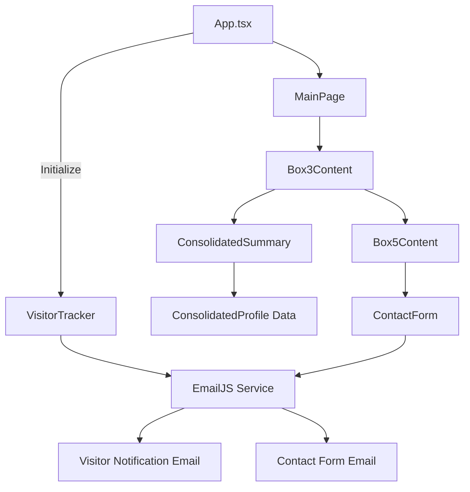

# WS-Portfolio-New Brownfield Enhancement Architecture

## Introduction

This document outlines the architectural approach for enhancing WS-Portfolio-New with privacy-focused portfolio refactoring capabilities and visitor tracking functionality. Its primary goal is to serve as the guiding architectural blueprint for AI-driven development of new features while ensuring seamless integration with the existing system.

**Relationship to Existing Architecture:**
This document supplements existing project architecture by defining how new components will integrate with current systems. Where conflicts arise between new and existing patterns, this document provides guidance on maintaining consistency while implementing enhancements.

### Existing Project Analysis

#### Current Project State

- **Primary Purpose:** Personal portfolio showcasing technical skills and projects
- **Current Tech Stack:** React 18.2.0, TypeScript, Vite 6.2.3, Styled Components, Framer Motion, EmailJS
- **Architecture Style:** Component-based Single Page Application (SPA)
- **Deployment Method:** Static frontend deployment via Vite build

#### Available Documentation

- Project brief outlining privacy and visitor tracking requirements
- Product requirements document (PRD) with detailed specifications
- User stories defining MVP features and acceptance criteria
- Product owner validation report with refinements

#### Identified Constraints

- Zero budget requirement - must use existing EmailJS free tier
- Must preserve existing visual design, animations, and branding
- Frontend-only architecture - no backend infrastructure
- One-week timeline for MVP completion
- Must maintain existing component structure and patterns

### Change Log

| Change               | Date       | Version | Description                                            | Author              |
| -------------------- | ---------- | ------- | ------------------------------------------------------ | ------------------- |
| Initial Architecture | 2025-01-04 | 1.0     | Created brownfield architecture for portfolio refactor | Winston (Architect) |

## Enhancement Scope and Integration Strategy

### Enhancement Overview

**Enhancement Type:** Privacy-focused content refactor with visitor analytics
**Scope:** Content restructuring, privacy compliance, and visitor tracking integration
**Integration Impact:** Medium - requires component modifications and new email templates

### Integration Approach

**Code Integration Strategy:** Modify existing components while preserving structure and styling patterns
**Database Integration:** No database - leveraging existing EmailJS infrastructure
**API Integration:** Extend existing EmailJS service with new visitor notification template
**UI Integration:** Seamless integration with existing Box component architecture

### Compatibility Requirements

- **Existing API Compatibility:** Maintain EmailJS service configuration and authentication
- **Database Schema Compatibility:** N/A - no database schema
- **UI/UX Consistency:** Preserve all existing visual design, animations, and component styling
- **Performance Impact:** Minimal - single additional EmailJS call on page load

## Tech Stack Alignment

### Existing Technology Stack

| Category           | Current Technology     | Version | Usage in Enhancement             | Notes      |
| ------------------ | ---------------------- | ------- | -------------------------------- | ---------- |
| Frontend Framework | React                  | 18.2.0  | Core component modifications     | Maintained |
| Language           | TypeScript             | 4.9.3   | All new code in TypeScript       | Maintained |
| Build Tool         | Vite                   | 6.2.3   | Build process unchanged          | Maintained |
| Styling            | Styled Components      | 5.3.11  | Preserve existing styling        | Maintained |
| Animation          | Framer Motion          | 10.15.1 | Preserve existing animations     | Maintained |
| Email Service      | EmailJS                | 3.11.0  | Visitor notification integration | Extended   |
| Icons              | FontAwesome            | 6.4.2   | UI consistency maintained        | Maintained |
| Security           | React Google reCAPTCHA | 3.1.0   | Contact form security            | Maintained |

### New Technology Additions

No new technologies required - enhancement leverages existing stack completely.

## Data Models and Schema Changes

### New Data Models

#### VisitorData Model

**Purpose:** Capture visitor information for email notifications
**Integration:** Used by new visitor tracking service

**Key Attributes:**

- ipAddress: string - Visitor's IP address from browser API
- userAgent: string - Browser user agent string
- timestamp: string - Visit timestamp in ISO format
- language: string - Browser language preference
- referrer: string - Document referrer if available

**Relationships:**

- **With Existing:** Integrates with existing EmailJS template system
- **With New:** Standalone model for visitor notifications

#### ConsolidatedProfile Model

**Purpose:** Replace separate Experience, Education, Skills sections
**Integration:** Replaces existing personalData structure

**Key Attributes:**

- summary: string - Consolidated professional summary
- coreCompetencies: string[] - Key technical and soft skills
- adaptabilityExamples: string[] - Evidence of learning agility
- yearsExperience: number - Total years of experience

**Relationships:**

- **With Existing:** Replaces personalData.experience, personalData.education, personalData.skills
- **With New:** Primary data source for consolidated summary component

### Schema Integration Strategy

**Database Changes Required:**

- **New Tables:** N/A - frontend data structures only
- **Modified Tables:** N/A - no database
- **New Indexes:** N/A - no database
- **Migration Strategy:** Data file refactoring in src/data/

**Backward Compatibility:**

- Preserve existing data file structure for portfolioData
- Maintain existing component interfaces during transition

## Component Architecture

### New Components

#### VisitorTracker Component

**Responsibility:** Capture visitor data and trigger email notification on page load
**Integration Points:** Integrated into App.tsx useEffect hook

**Key Interfaces:**

- Uses existing EmailJS service configuration
- Integrates with existing sendEmail utility pattern

**Dependencies:**

- **Existing Components:** Leverages existing EmailJS configuration
- **New Components:** Standalone tracking functionality

**Technology Stack:** React hooks, EmailJS, TypeScript

#### ConsolidatedSummary Component

**Responsibility:** Display unified professional summary replacing Experience/Education/Skills tabs
**Integration Points:** Replaces Cell4 component in Box3 architecture

**Key Interfaces:**

- Follows existing Box3 component patterns
- Uses existing styled-components approach

**Dependencies:**

- **Existing Components:** Integrates with Box3Content, maintains CardHeader pattern
- **New Components:** Uses ConsolidatedProfile data model

**Technology Stack:** React, Styled Components, TypeScript

### Component Interaction Diagram



## External API Integration

### EmailJS API

- **Purpose:** Email delivery service for visitor notifications and contact form
- **Documentation:** https://www.emailjs.com/docs/
- **Base URL:** https://api.emailjs.com/api/v1.0/
- **Authentication:** Public key authentication (3HyPrrduysCbj5IZK)
- **Integration Method:** Direct browser integration via @emailjs/browser library

**Key Endpoints Used:**

- `POST /email/send` - Send visitor notification emails
- `POST /email/send-form` - Send contact form submissions

**Error Handling:** Console logging with graceful degradation for visitor tracking

## Source Tree Integration

### Existing Project Structure

```
src/
├── components/
│   ├── box3/
│   │   ├── Box3Content.tsx
│   │   ├── cellContent/
│   │   │   ├── Cell4.tsx         # To be replaced
│   │   │   ├── Experience.tsx    # To be removed
│   │   │   ├── Education.tsx     # To be removed
│   │   │   └── Skills.tsx        # To be removed
│   ├── box5/
│   │   └── ContactForm.tsx       # Preserved
│   └── common/
│       └── sendEmail.tsx         # Extended
└── data/
    └── personalData.tsx          # Modified
```

### New File Organization

```
src/
├── components/
│   ├── box3/
│   │   ├── cellContent/
│   │   │   └── ConsolidatedSummary.tsx     # New unified summary component
│   └── common/
│       └── visitorTracker.tsx              # New visitor tracking service
└── data/
    └── consolidatedProfile.tsx             # New consolidated data model
```

### Integration Guidelines

- **File Naming:** Follow existing PascalCase for components, camelCase for utilities
- **Folder Organization:** Maintain existing box-based component structure
- **Import/Export Patterns:** Use existing ES6 import/export patterns with TypeScript

## Infrastructure and Deployment Integration

### Existing Infrastructure

**Current Deployment:** Static site deployment via Vite build process
**Infrastructure Tools:** Vite build, npm scripts
**Environments:** Development (npm run dev), Production (npm run build)

### Enhancement Deployment Strategy

**Deployment Approach:** Standard Vite build with no infrastructure changes
**Infrastructure Changes:** None required - purely frontend enhancements
**Pipeline Integration:** Uses existing build pipeline without modifications

### Rollback Strategy

**Rollback Method:** Git revert to previous commit with component restoration
**Risk Mitigation:** Preserve removed components in separate branch during transition
**Monitoring:** Browser console monitoring for EmailJS service health

## Coding Standards and Conventions

### Existing Standards Compliance

**Code Style:** TypeScript with React functional components and hooks
**Linting Rules:** ESLint with TypeScript preset
**Testing Patterns:** No existing test framework - manual testing approach
**Documentation Style:** JSDoc comments for complex functions

### Critical Integration Rules

- **Existing API Compatibility:** Maintain EmailJS service ID and template structure
- **Database Integration:** N/A - no database integration
- **Error Handling:** Console logging with graceful degradation for non-critical features
- **Logging Consistency:** Use existing console.log patterns for debugging

## Testing Strategy

### Integration with Existing Tests

**Existing Test Framework:** None - manual testing approach
**Test Organization:** Component-level manual testing
**Coverage Requirements:** Visual regression testing for existing functionality

### New Testing Requirements

#### Unit Tests for New Components

- **Framework:** Manual testing with browser developer tools
- **Location:** In-browser testing during development
- **Coverage Target:** All new components tested for core functionality
- **Integration with Existing:** Ensure no regression in existing component behavior

#### Integration Tests

- **Scope:** EmailJS integration, visitor tracking, contact form preservation
- **Existing System Verification:** Verify contact form continues to work
- **New Feature Testing:** Test visitor notification email delivery

#### Regression Testing

- **Existing Feature Verification:** Visual inspection of all existing components and animations
- **Automated Regression Suite:** N/A - manual verification approach
- **Manual Testing Requirements:** Complete user journey testing for existing portfolio functionality

## Security Integration

### Existing Security Measures

**Authentication:** Public key authentication for EmailJS service
**Authorization:** N/A - no user authentication required
**Data Protection:** Client-side only - no sensitive data storage
**Security Tools:** Google reCAPTCHA for contact form spam protection

### Enhancement Security Requirements

**New Security Measures:** Privacy compliance for visitor data collection
**Integration Points:** Ensure visitor tracking respects privacy regulations
**Compliance Requirements:** GDPR/CCPA compliance for visitor data handling

### Security Testing

**Existing Security Tests:** Manual verification of reCAPTCHA functionality
**New Security Test Requirements:** Verify no PII is logged or stored persistently
**Penetration Testing:** N/A - static frontend with no sensitive operations

## Next Steps

### Story Manager Handoff

The Portfolio Refactor enhancement is ready for story implementation. Key requirements:

- **Architecture Reference:** This document defines integration patterns with existing React/TypeScript/EmailJS system
- **Integration Requirements:** Maintain existing component structure while implementing privacy-focused changes
- **Existing System Constraints:** Zero budget, EmailJS free tier, preserve visual design and animations
- **First Story Priority:** Privacy Content Scrub (User Story 1) - lowest risk to existing system
- **Integration Checkpoints:** Verify each story maintains existing portfolio functionality

**Critical Success Factors:**

- Test visitor tracking without impacting existing contact form functionality
- Preserve all existing animations and styling during component modifications
- Ensure EmailJS service limits are not exceeded during implementation

### Developer Handoff

Implementation ready with validated brownfield architecture:

- **Architecture Foundation:** Existing React 18.2 + TypeScript + Vite + Styled Components + EmailJS stack
- **Integration Requirements:** Component modifications following existing patterns, EmailJS template extension
- **Technical Decisions:** Leverage existing EmailJS service, maintain component-based architecture, preserve styling approach
- **Compatibility Requirements:** Zero impact on existing portfolio functionality, maintain animation performance
- **Implementation Sequencing:**
  1. Privacy content scrub (lowest risk)
  2. Consolidated summary component (medium risk - component replacement)
  3. Visitor tracking integration (lowest risk - additive feature)
  4. Contact form verification (no changes - validation only)

**Verification Steps:**

- Test existing contact form functionality after each implementation phase
- Verify all existing animations and responsive behavior remain intact
- Confirm EmailJS service integration maintains existing template functionality
- Validate visitor tracking respects privacy requirements without persistent data storage
