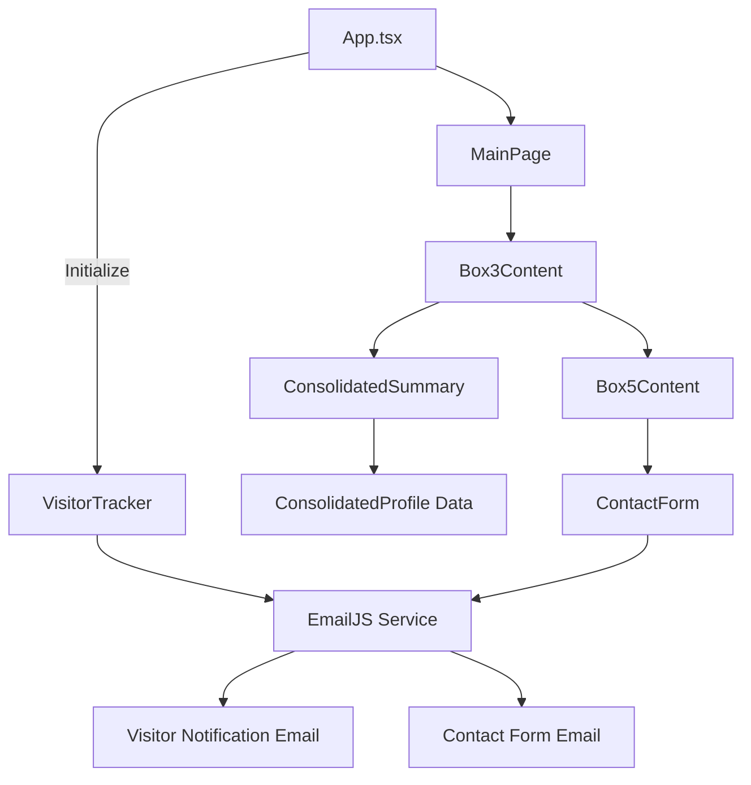

# Component Architecture

### New Components

#### VisitorTracker Component

**Responsibility:** Capture visitor data and trigger email notification on page load
**Integration Points:** Integrated into App.tsx useEffect hook

**Key Interfaces:**

- Uses existing EmailJS service configuration
- Integrates with existing sendEmail utility pattern

**Dependencies:**

- **Existing Components:** Leverages existing EmailJS configuration
- **New Components:** Standalone tracking functionality

**Technology Stack:** React hooks, EmailJS, TypeScript

#### ConsolidatedSummary Component

**Responsibility:** Display unified professional summary replacing Experience/Education/Skills tabs
**Integration Points:** Replaces Cell4 component in Box3 architecture

**Key Interfaces:**

- Follows existing Box3 component patterns
- Uses existing styled-components approach

**Dependencies:**

- **Existing Components:** Integrates with Box3Content, maintains CardHeader pattern
- **New Components:** Uses ConsolidatedProfile data model

**Technology Stack:** React, Styled Components, TypeScript

### Component Interaction Diagram

